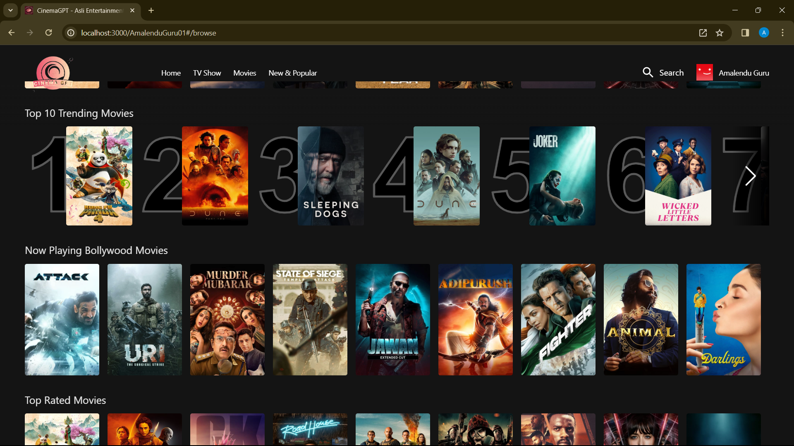

# CinemaGPT

CinemaGPT is a React Redux project that utilizes the power of OpenAI's GPT to suggest movies based on user searches.

## Features

- **Authentication**
  - Login and Sign up functionality with Firebase authentication.
  
- **Browse Page**
  - Displays main movie with trailer background, title, description, and action buttons.
  - Provides movie suggestions and AI-powered movie search.

- **Routing**
  - Utilizes React Router for seamless navigation.

- **Firebase Deployment**
  - Easily deploy your app using Firebase hosting.

- **TMDB Integration**
  - Fetches movie data and trailers from TMDB API.

- **OpenAI Integration**
  - Integrates OpenAI API for movie suggestions.

## Getting Started

1. Clone the repository.
2. Install dependencies using `npm install`.
3. Create a `.env` file with necessary API keys and configurations.
4. Start the development server with `npm start`.

## Technologies Used

- React
- Redux
- Firebase
- TMDB API
- OpenAI API
- TailwindCSS

## See the following screenshots of this project

- **Landing Page**

- **Sign Up Page**

- **Home page for logged in user**

- **Movie list category wise**

- **Just a shimmer effect :)**

- **Searching movie**

- **Searching movie on the basis of some choice entered by user**
- Implemented in code but not available right now in live site, because it is a paid feature.

- **Watching trailers and related videos page**

